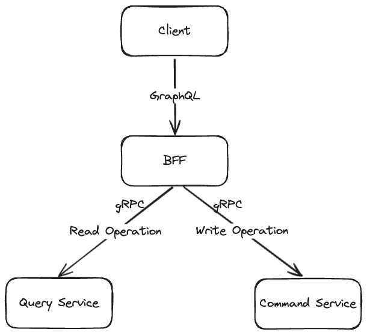

## Welcome to the repository for learning microservices in Go!

In this tutorial, we explore gRPC, GraphQL, and Kubernetes to develop Backend For Frontend (BFF) and microservices.

Moreover, we demonstrate deploying the services locally on Minikube using Kubernetes and Helm.

For detailed explanations, check out the accompanying blog posts [here](https://moonorange.github.io/posts/projects_to_learn/go_microservices/part1/).

## Project Structure

